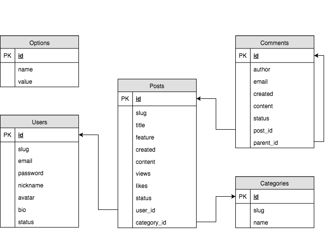

#准备工作

- 数据库设计
- 基本结构搭建

## 数据库设计

根据业务需求，设计数据库的结构（id关联，便于同时操作，数据同步，便于维护等）



### 选项表（Options）

用于记录网站的一些配置属性的信息，如：站点标题，站点描述等

| 字段  | 描述   | 备注       |
| ----- | ------ | ---------- |
| id    | 🔑 主键 |            |
| key   | 属性值 | snake_case |
| value | 属性值 | JSON格式   |

### 用户表（users）

用于记录用户信息

| 字段     | 描述    | 备注                                                         |
| -------- | ------- | ------------------------------------------------------------ |
| id       | 🔑 主键  | 自增                                                         |
| slug     | URL别名 |                                                              |
| email    | 邮箱    | 登录名                                                       |
| password | 密码    | 登录密码                                                     |
| nickname | 昵称    |                                                              |
| avatar   | 头像    | 图片URL路径                                                  |
| bio      | 简介    |                                                              |
| status   | 状态    | 未激活（unactivated）/ 激活（activated）/ 禁止（forbidden）/ 回收站（trashed） |

### 文章表（posts）

用于记录文章信息

| 字段        | 描述      | 备注                                                    |
| ----------- | --------- | ------------------------------------------------------- |
| id          | 🔑 主键    | &nbsp;                                                  |
| slug        | URL 别名  |                                                         |
| title       | 标题      |                                                         |
| feature     | 特色图像  | 图片 URL 路径                                           |
| created     | 创建时间  |                                                         |
| content     | 内容      | &nbsp;                                                  |
| views       | 浏览次数  | &nbsp;                                                  |
| likes       | 点赞数    | &nbsp;                                                  |
| status      | 状态      | 草稿（drafted）/ 已发布（published）/ 回收站（trashed） |
| user_id     | 🔗 用户 ID | 当前文章的作者 ID                                       |
| category_id | 🔗 分类 ID | 当前文章的分类 ID                                       |

### 分类表（categories）

用于记录文章分类信息

| 字段 | 描述     | 备注 |
| ---- | -------- | ---- |
| id   | 🔑 主键   |      |
| slug | URL别名  |      |
| name | 分类名称 |      |

### 评论表（comments）

用于记录所有文章的评论信息

| 字段      | 描述          | 备注                                                         |
| --------- | ------------- | ------------------------------------------------------------ |
| id        | 🔑 主键        |                                                              |
| author    | 作者          | &nbsp;                                                       |
| email     | 邮箱          |                                                              |
| created   | 创建时间      |                                                              |
| content   | 内容          | &nbsp;                                                       |
| status    | 状态          | 待审核（held）/ 准许（approved）/ 拒绝（rejected）/ 回收站（trashed） |
| post_id   | 🔗 文章 ID     |                                                              |
| parent_id | 🔗 父级文章 ID |                                                              |

## 搭建项目架构

项目最基本分为两大块（前台）和（后台）

### 基本目录结构


```html
└── baixiu........................................................项目文件夹（网站根目录）
	├─admin.......................................................后台文件夹
    │  ├─api......................................................api功能性文件夹
    │  ├─inc......................................................公共文件夹
   	│  └── index.php..............................................后台脚本文件
	├─static......................................................静态文件夹
    │  ├─assets...................................................资源文件夹
    │  │  ├─css...................................................自定义CSS样式文件夹
    │  │  ├─img...................................................静态img文件夹
    │  │  └─vendors...............................................框架文件夹
    │  │      ├─animate...........................................动画框架文件夹
    │  │      ├─bootstrap.........................................基本样式框架文件夹
    │  │      │  ├─css............................................基本CSS文件
    │  │      │  └─js.............................................基本JS文件
    │  │      ├─chart.............................................图表框架文件夹
    │  │      ├─font-awesome......................................字体框架文件夹
    │  │      │  ├─css............................................字体CSS文件
    │  │      │  └─fonts..........................................字体fonts文件
    │  │      ├─jquery............................................JQuery框架文件夹
    │  │      ├─jsrender..........................................渲染框架文件夹
    │  │      ├─moment............................................moment
    │  │      ├─nprogress.........................................进度条框架文件夹
    │  │      ├─require...........................................require
    │  │      ├─simplemde.........................................simplemde
    │  │      ├─swipe.............................................swipe
    │  │      ├─twbs-pagination...................................渲染文件夹
    │  │      └─ueditor...........................................渲染文件夹
    │  └─uploads.....................................................上传文件夹
    │      └─20181124................................................按日划分
	└─index.php......................................................前台脚本文件
```

### 基本原则

明确所需要多少页面，一个页面配合一个php文件去处理


### 项目配置文件

接下来的开发过程中，肯定需要连接数据库，数据库主机，数据库用户名和密码等，这些会经常被使用，抽象成一个配置文件`config.php`放到根目录下

**注意：**

1. 一般单独的php配置文件后面不加 php 结束标记，防止输出内容
2. 一般用到的公共配置文件中的常量名或者函数中的函数名尽量加上项目相关的前缀，防止和内置函数或者内置常量等冲突

这个配置文件采用定义常量的方式定义配置成员：

```php
 /**
  * 数据库主机
  */
 define('XIU_DB_HOST', 'localhost');

 /**
  * 数据库用户名
  */
 define('XIU_DB_USER', 'root');

 /**
  * 数据库密码
  */
 define('XIU_DB_PASS', 'Wqp516#');

 /**
  * 数据库名称
  */
 define('XIU_DB_NAME', 'baixiu');

 /**
  * 物理路径
  */
 define('ROOT_DIR', dirname(__FILE__));
```

**在需要使用的时候通过 require_once 载入**

```php
  /**
   * 载入公共配置文件
   */
  require_once '../config.php';
```

**载入脚本的几种方式对比**

- ``require``
- `require_once`
- `include`
- `include_once`
- **共同点**
  - 可以在PHP脚本文件执行时，载入另外一个PHP脚本文件
- `require` 和 `include`  的区别：
  - 当载入的脚本文件不存在时，`require`会报一个致命错误并结束文件执行，而`include`不会
- 有 `once` 后缀的特点
  - 只能载入一次

**显示  PHP  错误信息**

当执行 PHP 文件发生错误的时候，如果页面上不显示错误信息，只提示500 Internal Server Error 错误，应该是 PHP配置问题，开发环节应该找到 `php.ini`文件，把其中的 `display_errors` 设置为 `On`，当然上线环节就给其中的 `display_errors` 设置为 `Off`

```ini
; http://php.net/display-errors
; display_errors = Off
display_errors = On
; The display of errors which occur during PHP's startup sequence are handled
```

### 项目结构总结

总体项目结构规划如上，下面基于上面的基本约束进行项目开发工作，有利于后期维护工作

例如 `vendors` 目录的设置是为了存放外面引入的框架，每一种框架再分单独的文件夹，防止文件结构混乱

## 开始编码

对于网站开发人员来说，已经拿到的静态页面，需要修改成后台页面的修改成后台页面，并调整对应路径

### 整合静态资源文件

把所有已经有的 html 需要做后台功能的文件 全部拷贝到 admin 文件夹里，批量修改后缀名

批量替换

`命令行代码：`

`cd E:\www\site1\admin(需要替换的文件的目录)切换到该文件目录下 `

`批量替换命令 ren *.html *.php`


**注意：**绝对路径`or`相对路径`or`物理路径

根据已提交过来的目录结构，对应的修改文件路径(sublime中可以批量查找替换设置目录下的内容)

在`admin`项目文件夹下查找，注意 `../`需要以正则表达式的方式查找


查找后先点击右下角 `find` 大概看一下所需要替换的内容对不对


之后`replace`全部替换，`文件`--`保存全部`--`关闭其他`

### 抽离公共文件

分析所有后台文件，发现有 sidebar 和 navbar 部分，在后台所有文件中经常被使用，所以作为公共文件抽离出来

于是在`admin`目录中，创建一个`inc`文件夹，文件夹下创建两个文件`sidebar.php`和`navbar.php`分别用来存放公共侧边栏和公共导航栏的内容

`sidebar.php`

```php
  <div class="aside">
    <div class="profile">
      
      <h3 class="name">布头儿</h3>
    </div>
    <ul class="nav">
      <li class="active">
        <a href="index.html"><i class="fa fa-dashboard"></i>仪表盘</a>
      </li>
      <li>
        <a href="#menu-posts" class="collapsed" data-toggle="collapse">
          <i class="fa fa-thumb-tack"></i>文章<i class="fa fa-angle-right"></i>
        </a>
        <ul id="menu-posts" class="collapse">
          <li><a href="posts.html">所有文章</a></li>
          <li><a href="post-add.html">写文章</a></li>
          <li><a href="categories.html">分类目录</a></li>
        </ul>
      </li>
      <li>
        <a href="comments.html"><i class="fa fa-comments"></i>评论</a>
      </li>
      <li>
        <a href="users.html"><i class="fa fa-users"></i>用户</a>
      </li>
      <li>
        <a href="#menu-settings" class="collapsed" data-toggle="collapse">
          <i class="fa fa-cogs"></i>设置<i class="fa fa-angle-right"></i>
        </a>
        <ul id="menu-settings" class="collapse">
          <li><a href="nav-menus.html">导航菜单</a></li>
          <li><a href="slides.html">图片轮播</a></li>
          <li><a href="settings.html">网站设置</a></li>
        </ul>
      </li>
    </ul>
  </div>
```

`navbar.php`

```php
    <nav class="navbar">
      <button class="btn btn-default navbar-btn fa fa-bars"></button>
      <ul class="nav navbar-nav navbar-right">
        <li><a href="profile.html"><i class="fa fa-user"></i>个人中心</a></li>
        <li><a href="login.html"><i class="fa fa-sign-out"></i>退出</a></li>
      </ul>
    </nav>
```

修改`sidebar.php`和`navbar.php`中的访问链接，一般 `.html` 全部改为 `.php`


### 抽离公共文件后操作

需要给每个后台文件载入公共文件，并做一些简单的细节处理

**在每个后台文件中载入公共文件**

```php
  /**
   * 载入导航栏
   */
<?php include 'inc/navbar.php'; ?>
  /**
   * 载入 侧边栏
   */
<?php include 'inc/sidebar.php'; ?>
```

**侧边栏选中状态展开和高亮展示**

- 给每个文件侧边栏上面定义一个标志性的变量`current_page`，方便侧边栏选中的时候操作

```php
<?php $current_page = 'categories'; ?>
```


- 在`sidebar.php`文件中的对应位置设置判断变量`current_page`的值，让相应值得位置高亮

```php
<?php echo $current_page === 'categories' ? ' class="active"' : '' ?>
```

- 在`sidebar.php`文件中，有些隐藏菜单选中菜单的处理，利用数组，例如对页面中文章的隐藏菜单的处理

```php+html
<?php $menu_posts = array('posts', 'post-add', 'categories'); ?>
    <li<?php echo in_array($current_page, $menu_posts) ? ' class="active"' : '' ?>>
      <a href="#menu-posts"<?php echo in_array($current_page, $menu_posts) ? '' : ' class="collapsed"' ?> data-toggle="collapse">
        <i class="fa fa-thumb-tack"></i>文章<i class="fa fa-angle-right"></i>
      </a>
  <ul id="menu-posts" class="collapse<?php echo in_array($current_page, $menu_posts) ? ' in' : '' ?>">
     <li<?php echo $current_page === 'posts' ? ' class="active"' : '' ?>><a href="/admin/posts.php">所有文章</a></li>
     <li<?php echo $current_page === 'post-add' ? ' class="active"' : '' ?>><a href="/admin/post-add.php">写文章</a></li>
     <li<?php echo $current_page === 'categories' ? ' class="active"' : '' ?>><a href="/admin/categories.php">分类目录</a></li>
  </ul>
```

