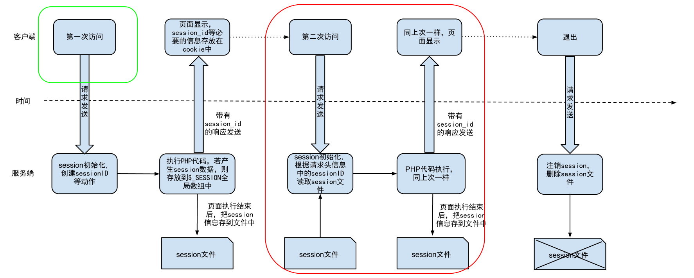
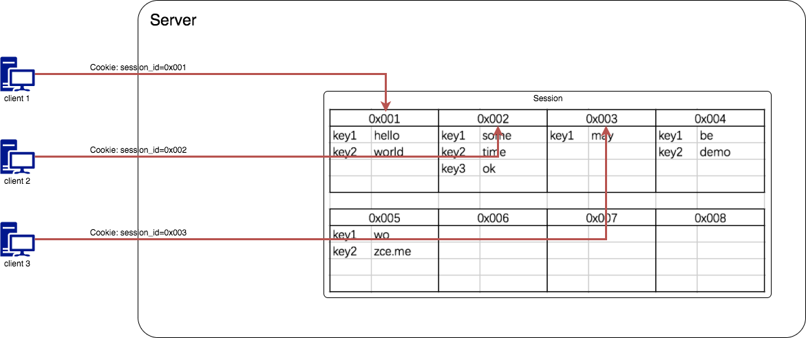

# 管理后台登录（login.php）

## 处理 HTML 中需要调整的位置

在处理后台信息响应时，一般需要先处理`html`中表单的`action`和 `method`属性，还有表单元素`name`属性等

这里需要调整的有：

- 给`login.php`文件中的`form`表单添加`action`和`method`属性，细节处理（`novalidate`取消浏览器自带校验功能，`autocomplete = 'off'`取消浏览器表单自动补全功能）

```php+html
<form class="login-wrap" action="<?php echo $_SERVER['PHP_SELF']; ?>" method="post" autocomplete="off" novalidate>
```

- 给邮箱和密码添加`name`属性，细节处理（`autofocus`当页面加载时获得焦点）

```html
 <div class="form-group">
   <label for="email" class="sr-only">邮箱</label>
   <input id="email" name="email" type="email" class="form-control" placeholder="邮箱" autofocus value="">
   </div>
   <div class="form-group">
     <label for="password" class="sr-only">密码</label>
     <input id="password" name="password" type="password" class="form-control" placeholder="密码">
   </div>
</div>
```

- 将登录按钮`a`改为`button`提交按钮

```html
<button class="btn btn-primary btn-block">登 录</button>
```


## 登录业务逻辑

- 当用户第一次访问登录页面时，客户端会使用 `GET`方式向服务端发送需要一个登录请求，此时服务端会响应一个含有登录表单的`HTML`给客户端
- 当用户填写完成表单`email`失并失去焦点时，利用`script`标签可以通过`JQuery`的`get`方法向服务端发送一个`get`请求，服务端同时连接并查找数据库对应头像地址，返回一个对应的头像地址给可客户端并在客户端呈现出来
- 用户填写完表单点提交按钮，客户端会对服务端发送一个`post`请求，服务端连接数据库并校验表单正确性，若正确，则跳转到 后台主页面`index.php`
- `login.php`文件的大致处理逻辑如下

```flow
s=>start: 开始
o1=>operation: 用户请求 login.php
c1=>condition: 是否是 POST 请求
c2=>condition: 参数是否完整
o2=>operation: 接收表单参数
o3=>operation: 处理登录逻辑
c3=>condition: 邮箱与密码是否匹配
o4=>operation: 跳转到后台页面
o5=>operation: 输出错误消息
o6=>operation: 渲染登录页面
o7=>operation: 响应 HTML
e=>end: 结束

s->o1->c1
c1(yes)->c2
c2(yes)->o2->o3->c3
c3(yes)->o4->e
c3(no)->o5->o6->o7(left)->e
c2(no)->o5->o6->o7(left)->e
c1(no)->o5->o6->o7(left)->e
```


### 判断用户是否以POST方式请求

在`PHP`脚本开始执行时，判断当前请求是否以`post`方式提交

```php
if ($_SERVER['REQUEST_METHOD'] === 'POST') {
  login();
}
```

**md5()不保险之后的加密方式**

自定义一个规则，例如加上`uniqid()`随机`id`或者加一些标志连接到字符串，记录并存储到数据库，这样的规则没有特定性，不太容易破解

### 校验表单时错误信息展示

如果执行逻辑时，表单法发生错误，界面上必须要出现一个错误信息的提示，出错后定义一个变量，呈现到`HTML`页面上，并对应的让表单抖动(`animate`脚本的应用)

`php`代码

```php
  if (empty($_POST['email'])) {
    $GLOBALS['message'] = '请填写邮箱';
    return;
  }
  if (empty($_POST['password'])) {
    $GLOBALS['message'] = '请填写密码';
    return;
  }
```

**接收参数**

```php
  $email = $_POST['email'];
  $password = $_POST['password'];
```

**连接数据库并校验信息**

```php
 // 当客户端提交过来的完整的表单信息就应该开始对其进行数据校验
  $conn = mysqli_connect(XIU_DB_HOST, XIU_DB_USER, XIU_DB_PASS, XIU_DB_NAME);
  if (!$conn) {
    exit('<h1>连接数据库失败</h1>');
  }

  $query = mysqli_query($conn, "select * from users where email = '{$email}' limit 1;");

  if (!$query) {
    $GLOBALS['message'] = '登录失败，请重试！';
    return;
  }

  // 获取登录用户
  $user = mysqli_fetch_assoc($query);

  if (!$user) {
    // 用户名不存在
    $GLOBALS['message'] = '邮箱与密码不匹配';
    return;
  }

  // 一般密码是加密存储的 但md5()加密现在不保险，已经可以破解了
  if ($user['password'] !== md5($password)) {
    // 密码不正确
    $GLOBALS['message'] = '邮箱与密码不匹配';
    return;
  }

  // 存一个登录标识
  // $_SESSION['is_logged_in'] = true;
  // 为了后续可以直接获取当前登录用户的信息，这里直接将用户信息放到 session 中
  $_SESSION['current_login_user'] = $user;
  // $_SESSION['current_login_user_id'] = $user['id'];

  // 一切OK 可以跳转
  header('Location: /admin/index.php');
```

`HTML`代码    引入`animate`脚本

```html
<link rel="stylesheet" href="/static/assets/vendors/animate/animate.css">
```

`HTML+php`代码    `HTML`页面呈现错误信息，假如错误，需要抖动提醒

```php+html
<form class="login-wrap<?php echo isset($message) ? ' shake animated' : ''; ?>" action="<?php echo $_SERVER['PHP_SELF']; ?>" method="post" autocomplete="off" novalidate>
      
      <!-- 作为一个优秀的页面开发人员，必须考虑一个页面的不同状态下展示的内容不一样的情况 -->
      <!-- 有错误信息时展示 -->
      <?php if (isset($message)): ?>
      <div class="alert alert-danger">
        <strong>错误！</strong> <?php echo $message; ?>
      </div>
      <?php endif ?>
      <div class="form-group">
        <label for="email" class="sr-only">邮箱</label>
        <input id="email" name="email" type="email" class="form-control" placeholder="邮箱" autofocus value="<?php echo empty($_POST['email']) ? '' : $_POST['email']; ?>">
      </div>
      <div class="form-group">
        <label for="password" class="sr-only">密码</label>
        <input id="password" name="password" type="password" class="form-control" placeholder="密码">
      </div>
      <button class="btn btn-primary btn-block">登 录</button>
  </form>
```

### 表单状态保持

当用户填写错误的邮箱或密码提交过后，再次得到 HTML 页面显示时，除了可以看见错误信息，应该也可以看到之前填写邮箱（非敏感数据）

为当前`input`添加一个`value`属性，属性值为接收到的参数`$_post['email']`

```php+html
<input id="email" name="email" type="email" class="form-control" value="<?php echo isset($_POST['email']) ? $_POST['email'] : ''; ?>" placeholder="邮箱" autofocus>
```

### 访问控制以及登录状态保持

  **名词解释：**

访问控制：一般指我们对于页面是否允许被访问的判断逻辑，这里指输入了正确的账户密码的用户或者						管理员登录。

至此，已经完成了登录校验的功能，但是如果记住了登录状态后，才可以约定页面地址，直接在地址栏输入，则可以越过登录直接访问，这样的话，登录页就失去了价值

**解决方案**

一般根据用户之前的访问状态来决定是否让用户访问，这里使用`cookie`方案

#### Cookie 方案

由于 HTTP 本来就是无状态的（每一次见面都如同“初次见面”）,如果仅仅单纯的希望我们的程序记住每一个访问者是不可能的，所以必须借助一些技巧或者标识让服务端记住客户端，这就是**Cookie**


**Cookie** 就像是在超级市场买东西拿到的小票，由超市（Server）发给消费者（Browser），超市方面不用记住每一个消费者的脸，但是他们认识消费者手里的小票（Cookie），通过小票知道消费者之前的一些消费信息（在服务端产生的数据）。

**通过Cookie解决以上问题**

```php
...
// 用户存在，密码比对
if ($user['password'] == $password) {
  // 给用户发一个小票（Cookie），通过 Cookie 保存用户的登录状态
  setcookie('is_logged_in', 'true');
  // 匹配则跳转到 /admin/index.php
  header('Location: /admin/index.php');
  exit; // 结束脚本的执行
}
...
```

#### session 方案

通过 Cookie 方案实现了服务端对客户端登录状态的辨别，但是由于 Cookie 是下发给客户端由客户端本地保存的。换而言之，客户端可以对其随意操作，包括删除和修改。那么如果客户端随意伪造一个 Cookie 的话，对于服务端是无法辨别的，就会造成服务端被蒙蔽，误认为客户端已经登录。

于是就有了另外一种基于 Cookie 基础之上的手段：**Session**



Session 区别于 Cookie 一个很大的地方就是：Session 数据存在了服务端，而 Cookie 存在了客户端本地，存在服务端最大的优势就是，不是用户想怎么改就怎么改了。



Session 这种机制会更加适合于做登录状态保持，因为客户端不再保存具体的数据，只是保存一把“钥匙”，伪造一把可以用的钥匙，可能性是极低的，所以不需要在意。

http://php.net/manual/zh/session.examples.basic.php

所以我们将之前使用 Cookie 的地方改为使用 Session：

`login.php`

```php
session_start();
// 直接将用户信息放到 session 中
$_SESSION['current_login_user'] = $user;
```

`index.php`

```php
 if (empty($_SESSION['current_login_user'])) {
    // 没有当前登录用户信息，意味着没有登录
    header('Location: /admin/login.php');
    exit(); // 没有必要再执行之后的代码
  }
  return $_SESSION['current_login_user'];
```

## 公共函数的封装

因为考虑到每个页面都需要先验证登录信息，所以将公共使用到的函数`xiu_get_current_user`进行封装(functions.php)，放到网站的根目录下，细节（需要先载入文件，同时为了方便下面验证使用过`seession`加密的用户信息，先开启`session`）

`functions.php`

```php
require_once 'config.php';
session_start();
/**
 * 封装大家公用的函数
 * 定义函数时一定要注意：函数名与内置函数冲突问题
 * PHP 判断函数是否定义的方式： function_exists('get_current_user');
 */
/**
 * 获取当前登录用户信息，如果没有获取到则自动跳转到登录页面
 * @return [type] [description]
 */
function xiu_get_current_user () {
  if (empty($_SESSION['current_login_user'])) {
    // 没有当前登录用户信息，意味着没有登录
    header('Location: /admin/login.php');
    exit(); // 没有必要再执行之后的代码
  }
  return $_SESSION['current_login_user'];
}
```

