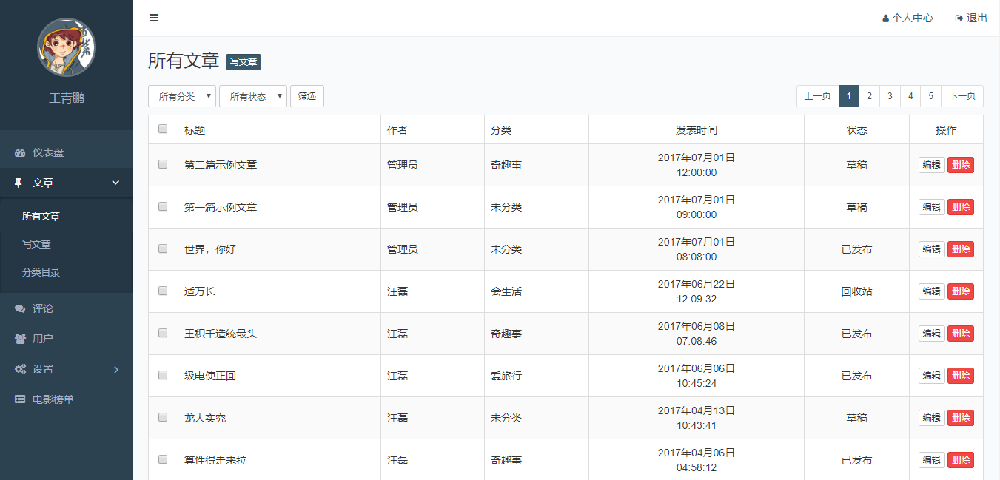

## 项目基本功能预演

一个自媒体信息发布平台

## 管理员（编辑）可以通过后台管理界面发布或者维护自媒体内容

## 功能简介

- 用户登录（login.php）

  - 根据用户是否填写表单内容或者表单内容是否正确来决定是否拒绝用户登录操作
  - 管理员可以通过用户名和密码登录到后台

- 默认页面（index.php）

  - 图表展示网站整体数据

    

- 文章管理（posts.php、post-add.php、categories.php）

  - 所有文章（posts.php）

    - 页面呈现数据库查询到的数据

    - 侧边栏高亮

    - 筛选工功能

    - 分页功能

    - 编辑和删除功能

      

  - 写文章（post-add.php）

    - 添加文章

    - 富文本编辑

      

  - 分类目录（categories.php）

    - 添加、编辑、删除、查询

      

- 评论管理

  - 数据库查询后数据呈现

  - 分页功能

  - 驳回、拒绝、删除、查询操作

    

- 用户管理

  - 表单验证

  - 添加、编辑、删除、查询等

    

- 后台设置（nav-menus.php、slides.php、settings.php）

  - 导航菜单（nav-menus.php）

    - 表单验证

    - 添加、编辑、删除、查询等

      

  - 图片轮播（皮肤）

    

     

  - 网站设置

    - 表单优化

      

- 电影榜单

  - 请求非同源api获取在线数据

    

  

- 用户可以通过前台查看内容

  

  ## 公共模块

  首页、侧边栏和中心版块

